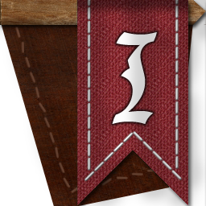
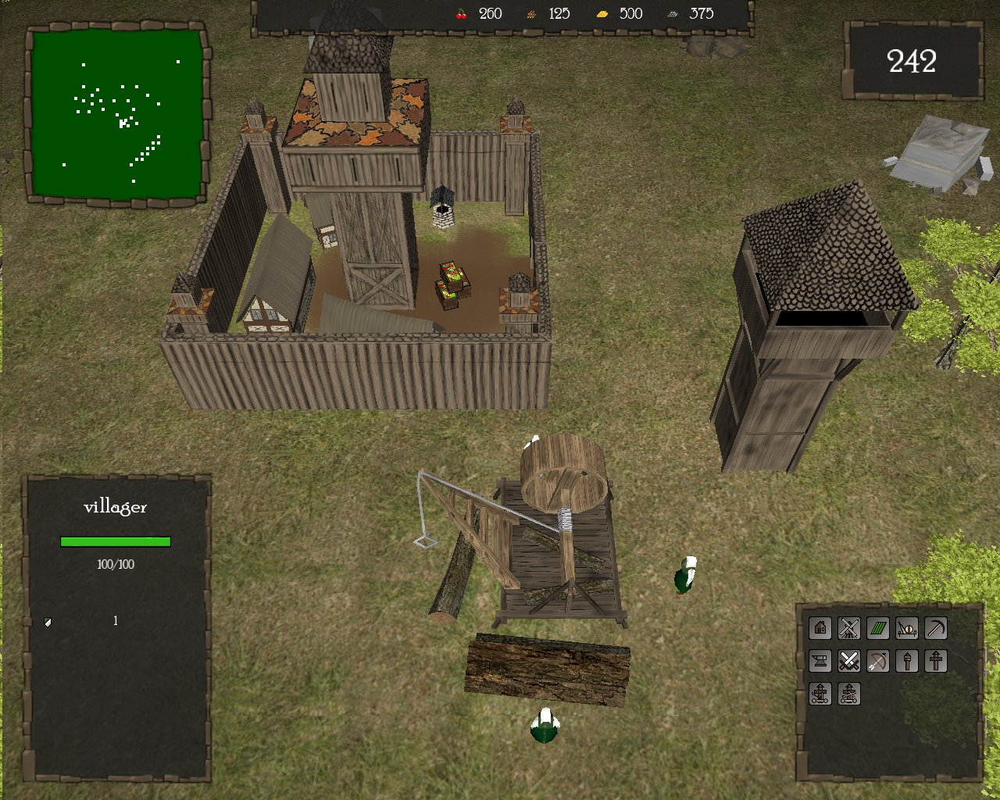

# Invasion

#### Table of Contents
1. [Version History](#version-history)
2. [Screenshot](#screenshot)
3. [Bugs](#bugs)
4. [Download](#download)
5. [License](#license)

The Invasion project is a mix of real time strategy and tower defense game. It
will lead you through the middle ages and the dark times of the barbarian
invasions...

Everything has been developed from scratch: UI, buildings, units, game engine,
etc.

Keep yourself up to date by reading our
[devblog](http://invasion.montmartel.com/index.php/blog).

##  Story 

Imagine: You come from a Kingdom, far, far away, to explore new territories for
your Empire. The place where you settled down looks beautiful, peaceful, and
lonely. However, one day, you are being attacked: those thieves  want your Gold,
resources and wives. Fortunately, you have some soldiers to protect your
village.  The attack was just beaten back. Yet you know who these strange people
are: barbarians, mercenaries. They will come back. From now on it is war! You
have to build defenses. Towers, walls, barracks, archery facilities are built.
Farmers are trained to become soldiers and the little village turns into a
fortified town. A second battle takes place and you lose a lot of your people.
You have to urgently develop better arms, suits of armor and boots. Now, all of
your farmers are soldiers and their wives have to work in the fields, cut down
trees, collect stone and gold. The war machinery is in full motion. Your only
task is to defend your village or you are going to die.

Good luck knight and don’t forget: barbarians are able to come from anywhere…

## Version History

* **Alpha 15:** Many bugfixes. Menu interface added, more waves are comming,
  description of each building (in french for the moment), and more...
* **Alpha 09:** Minor bugfixes. Counter has been added.
* **Alpha 08:** Multiple bugfixes. Units are resized.
* **Alpha 01:** First release

## Screenshot

## Bugs

Please report all bugs via the [GitHub
Issues](https://github.com/SamuelGauthier/Invasion/issues)

## Download

The compiled game can be downloaded under
[sourceforge](https://sourceforge.net/projects/gameinvasion/)

## Licence  

Invasion (c) by Invasion Team

Invation is licensed under a Creative Commons
Attribution-NonCommercial-ShareAlike 4.0 International License.

You should have received a copy of the license along with this
work. If not, see <http://creativecommons.org/licenses/by-nc-sa/4.0/>.

